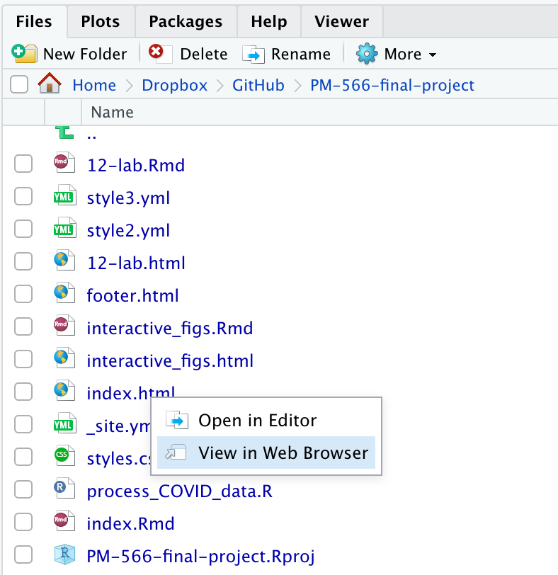
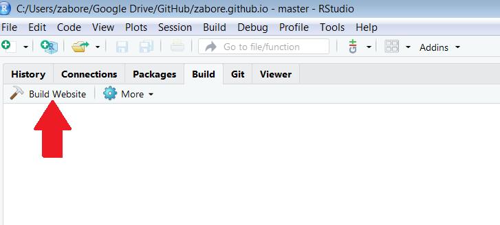
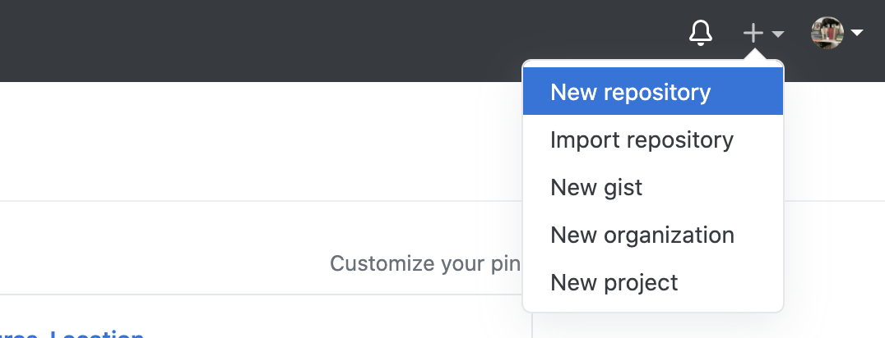
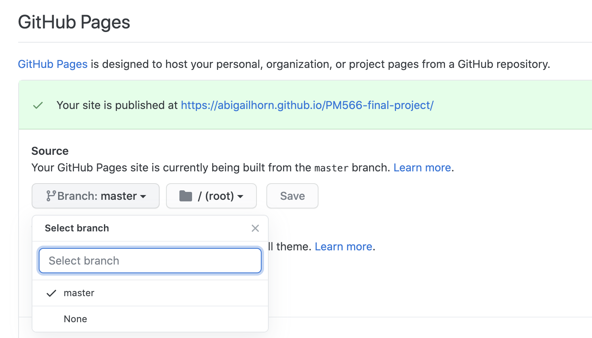

```{r setup, message=FALSE, echo=FALSE, warning=FALSE}

library(tidyverse)
library(plotly)
library(widgetframe)
library(tidytext)

# INITALIZE CODE CHUNK OPTIONS
knitr::opts_chunk$set(
  warning = FALSE,
  message = FALSE,
  eval=TRUE,
  echo = TRUE,
  cache = FALSE,
  fig.width = 7, 
  fig.align = 'center',
  fig.asp = 0.618,
  out.width = "700px",
  class.source = "code-r")
```


```{css, echo = FALSE}
.code-r { /* Code block */
  font-size: 15px;
}

.code-r-small { /* Code block */
  font-size: 10px;
}
```


<br>

# Objectives

The objective of today's lab is to create a website using the **rmarkdown** package and deploy it using GitHub pages.
We will include interactive visualizations (e.g. `plot_ly()` output) on the website.

For this lab, we have created some initial content for you to work with for an example website: https://github.com/JSC370/JSC370-2024/tree/main/labs/lab12

Your objective will be to create your own personal project website using this as a reference.

<br>

----

# Workflow Overview

Building websites uses the same reproducible workflow you can use for your analyses and collaborations. It is very iterative. You can do it all from RStudio, with a combination of clicking or typing commands as you feel comfortable. 

There are two main steps for creating a personal website that will be hosted on GitHub:

I. Local setup
II. GitHub setup

<br>

----

<br>

# I. Local Setup

The basic workflow is as follows:

1. Create a project directory and an R Project file (`.Rproj`)
1. Create a `_site.yml` and `index.Rmd` file in your new directory
1. Add additional page content if desired through other `.Rmd` files
1. Edit these files to create content and manage layout (and knit to view)
1. Add a style sheet (CSS) if desired
1. Build website
    - Build tab > Build Website or
    - in the console: `rmarkdown::render_site()`
This creates the output: `index.html`

<br>

## Step 0: Look at existing content

Clone the website repository at https://github.com/JSC370/JSC370-2024/tree/main/labs/lab12 with example project website content into a directory for the lab, e.g. `"lab-12"`. 

**Note**: we are not initializing this as a git repository, we will do that in Step 1. We are just downloading the contents.

```shell
mkdir ~/week12-lab
git clone https://github.com/JSC370/JSC370-2024/tree/main/labs/lab12
open JSC370-final-project.Rproj
```

- Check out the contents of this repository. What files does it contain?


<br>

## Step 1: Create project website directory

Create and go to the directory you want to create your website in, e.g. `"my-website"`, and initialize git. 

In command line:

```shell
mkdir ~/my-website
cd ~/my-website
git init
```

<br>

## Step 2: Create and add essential files

Recall from lecture that the minimum requirements for an R Markdown website are:

- `index.Rmd`: contains the content for the website homepage
- `_site.yml`: contains metadata for the website

Create these essential files, as well as a `README.md`, add all to git queue, and commit to your website repository.

**Note**: Use the `touch` command from command line to initialize empty files:

```shell
echo My JSC370 Final Project Website > README.md
touch _site.yml
touch index.Rmd
git add --all
git commit -m "initalizing repository"
```

<br>

## Step 3: Create `.Rproj` file

Create an R Project file using RStudio IDE:

Go to RStudio IDE > File > New Project > Existing Directory

<div align="center"></div>

The R Project is useful because RStudio will recognize your project as a website, and provide appropriate build tools. 

**Note**: After creating the R Project and initial files, you *may* need to close the project and reopen it before R will recognize it as a website and show the appropriate build tools.

<br>

## Step 4: Edit the content

### Step 4.1: Edit the YAML file

Edit the `_site.yml` file to include the metadata, layout, and theme you want for your website. 

First let's take a look at a basic example of a `_site.yml` file for a website with one page:

```markdown
name: "my-website"
navbar:
  title: "My Website"
  left:
    - text: "Home"
      href: index.html
```

This is the minimum you need to include in your `_site.yml`.

Now let's take a look at the `_site.yml` from the website repository you downloaded into `"lab-12"`. It looks like this:

```markdown
name: "my-website"
output_dir: "."
navbar:
  title: "JSC370 Final Project"
  left:
    - text: "Home"
      href: index.html
  right:
    - icon: fa-github fa-lg
      href: https://github.com/JSC370/JSC370-2024/
    - text: "JSC370 Home"
      href: https://jsc370.github.io/JSC370-2024/
output:
  html_document:
    theme: cosmo
    include:
      after_body: footer.html
    css: styles.css
```

Inspecting this, how do you add links to internal webpages? How do you add links to external websites? How do you add icons?

**Note**: recall that the `output_dir` field indicates which directory to copy site content into (`"_site"` is the default if none is specified). It can be `"."` to keep all content within the root website directory alongside the source code.

**Note**: Preview themes [here](https://www.datadreaming.org/post/r-markdown-theme-gallery/#:~:text=There%20are%2012%20additional%20themes,your%20theme%20from%20the%20default%20.) and play around with different options. Themes are easy to change even after you have added content. 

Now your task is to create a YAML for your website that includes only the essential components for your website. Either copy the content of the simple `_site.yml` into your own `_site.yml` file in your website directory `my-website`, or replicate it yourself line by line.

<br>

### Step 4.2: Edit internal `.Rmd` files

Edit and create `.Rmd` files that contain your website content, which will produce the html pages of your website when you knit them. 

For example, the `index.Rmd` could look like this:

```markdown
---
title: "JSC370 Final Project"
author: "Your Name"
output: 
    html_document:
        toc: TRUE
        toc_float: TRUE
---

This is my JSC370 Final Project website.

```

<br>

Recall that the `toc` specifies whether there is a table of contents, and `toc_float` provides the option to float the table of contents to the left of the main document content. The floating table of contents will always be visible even when the document is scrolled. There are other options for how to display the `toc` in R Markdown HTML output which you can read about [here](https://bookdown.org/yihui/rmarkdown/html-document.html#table-of-contents).

<br>

After you are done with your `index.Rmd` file, knit it to check the output. Either click the `Knit` option in the toolbar or in the console type `rmarkdown::render_site("index.Rmd")`. This will render the output into a file `index.html` which you can check out by opening the file in your directory:

<div align="center"></div>


<br>

## Step 5: Build website

Now we have the content and layout setup, we can build the website! This can be done in two ways:

- Build tab > Build Website

<div align="center"></div>

- in the console: `rmarkdown::render_site()`

**rmarkdown** has created all the additional files you need for your website. Check them out in your directory. Most importantly, the `index.html` file provides with a preview of the site, which you can look at in a browser as above:

<div align="center"></div>

<br>

----

# II. GitHub setup

## Overview

1. Create project on GitHub
1. Initialize project on Git
1. Push project files to the GitHub repository for your project
1. Deploy the website by enabling GitHub pages for the repository

<br>

## Step 6: Create project on GitHub

Create an online (remote) repository for your project using GitHub

<div align="left"></div>

<br>

## Step 7: Initialize project with git

In command line: 

Add the remote using `git remote add`

```shell
git remote add origin https://github.com/YOUR_GITHUB_NAME/YOUR_PROJECT_NAME.git
```

Optionally, use the commands `git status` and `git remote -v` to check out the status.

## Step 8: Push website content to remote

Push the changes to the remote using `git push`

```shell
git push -u origin master
```

<br>

## Step 9: Deploy the website

Enable GitHub pages for the repository by going to the repository's Settings > GitHub Pages, where you'll select the "master branch" folder and hit Save:

<div align="center"></div>

<br>

## Step 10: Preview content!

It's live! Go to the website at www.YOUR_GH_NAME.github.io/YOUR_PROJECT_NAME/ (the website should appear to you when you click the appropriate setting in GitHub Pages)

<br>

----

# III. Add interactive visuals

Your task here is to create 2 interactive visuals, using **plotly**, **leaflet**, **DT**, or anything else you have explored, and post them on your website at `index.Rmd`.

<br>

## Step 11: Source processing code

First you can source any necessary code, meaning run it. For example, let's use the Starbucks data we explored in week 11. In the example repository you downloaded into `"week12-lab"`, we have provided the code `process_starbucks_data.R` which goes through the first steps we carried out in the lab of downloading and processing the data. To source this code:

```{r load-data, eval=FALSE}
source("process_starbucks_data.R")
```

Recall that `echo=FALSE` means the code itself will not appear in the HTML output. You can also set this globally in `opts_chunk$set(echo=FALSE)` (see above for this lab)

<br>

## Step 12: Add code for visuals

Then you can add some code chunks to create the interactive visuals you want to include. I will add some code to create a couple of the **plotly** figures we created in lab. I am naming each plot but not outputting them here, because I will want to do that in independent code chunks as we will see in the next step.

**Note**: Code chunks cannot have the same name, so if you do name them (like this one: `plot1`), you will need to be sure to give each an independent name.

```{r plot1, class.source="code-r-small"}


```

<br>

Now, please create 2 figures of your own, either using the code from last week's lab, or creating new figures based on the data created by the `process_starbucks_data.R` code.

## Step 13: Display figures in tabs {.tabset}

Create tabs to display each figure. We do that using the following R Markdown language:

````markdown

## Showcasing plots {.tabset}

### Figure 1

`r ''````{r echo=FALSE}
p1_scatter
```

### Figure 2

`r ''````{r echo=FALSE}
p2_scatter
```

{-}

````

The output will look like this:

### Figure 1

```{r p1, echo=FALSE}

```

### Figure 2

```{r p2, echo=FALSE}

```

## {-}

<br>

Knit the page `index.Rmd` to check the output. It may take a bit longer now that we're also processing the data from the NYT. (Recall from lecture we can do that once per session by inputting the global option `opts_chunk$set(cache=TRUE)`).

<br>

## Step 14: Update website content

You've now made some edits to your website. To get the updates onto the live webpage, you need to re-render the site to create the HTML output from your `.Rmd` file edits, and push the updates to the remote GitHub repository:

- In the R console: `rmarkdown::render_site()`

- Preview contents by looking at the `index.html` file in a browser

- Add and push changes to remote from your website project repository locally (e.g. `JSC370-final-project`):

```shell
git add --all
git commit -m "interactive visuals"
git push -u origin master
```

Preview your changes online at your website! Note that it may take up to 10 minutes for the content to render.

<br>

## Step 15: Turn in your lab

Add the online link to your website in your `README.md` file, e.g.

```
This is my JSC370 Final Project website home. The website is online at https://github.com/yourname/my-site.
```

Then please submit your lab by creating a document with the link to your github site and upload to quercus.


<br>
<br>

# References

This lab pulled from:

- [Chapter 10.5: Websites in rmarkdown’s site generator](https://bookdown.org/yihui/rmarkdown/rmarkdown-site.html) in [R Markdown: The Definitive Guide](https://bookdown.org/yihui/rmarkdown/), Yihui Xie, J. J. Allaire, Garrett Grolemund
- [Creating websites in R](https://www.emilyzabor.com/tutorials/rmarkdown_websites_tutorial.html), Emily C. Zabor   


 


<br>
<br>